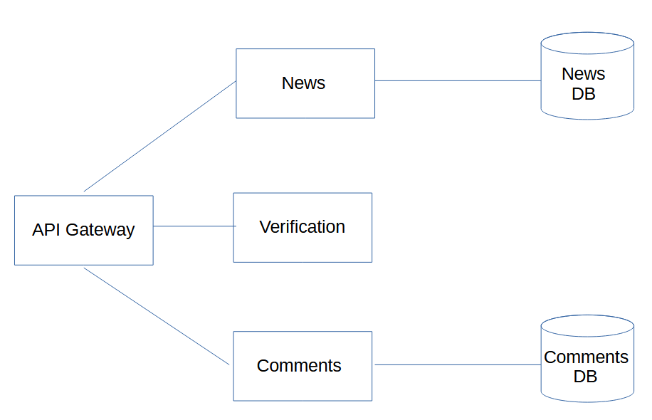

# API Gateway

[](API_Gateway.PNG)

Проект состоит из следующих компонентов:

+ ***News DB*** - База PostgreSQL для хранения новостей
+ ***Comments DB*** - База PostgreSQL для хранения комментариев к новостям
+ ***News*** - агрегатор новостей с RSS лент. Файл конфигурации с RSS лентами config.json
+ ***Comments*** - сервис комментариев
+ ***Verification*** - сервис проверки комментариев на наличие запрещённых слов. В нашем примере это "qwerty", "йцукен", "zxvbnm"
+ ***API Gateway*** - обработчик запросов пользователей

Проект реализован с использованием микросервисной архитектуры. Каждый компонент запускается в отдельном docker контейнере.

Для разворачивания и запуска контейнеров используйте команду:
```
docker-compose up
```
При необходимости, параметры запуска микросервисов можно изменить в файле ***docker-compose.yml*** и соответствующих ***Dockerfile***\
Используемые порты по умолчанию:
```
http://localhost:8080		- API-gateway (точка входа для запросов от клиентов)
http://localhost:8081		- News
http://localhost:8082		- Comments
http://localhost:8083		- Verification
5432                            - DB
```

### Варианты обрабатываемых запросов:

+ Получение списка новостей (GET):
    - http://localhost:8080/newsList

        - возможные дополнительные параметры:
            ```
            | параметр   | описание                                  |
            |------------|-------------------------------------------|
            | amount     | число новостей на странице (default = 10) |
            | page       | порядковый номер страницы  (default = 1)  |
            | search     | поиск по строке в заголовке (default = "")|
            | request_id | идентификатор запроса (autogen by default)|
            |--------------------------------------------------------|
            ```
            Пример: http://localhost:8080/newsList?amount=2&page=1&search=новость&request_id=555555

            Структура ответа:
            ```json   	
            {
                "NewsList":[
                    {
                        "ID":1,
                        "Title":"Новость-1",
                        "PubTime":1710792519
                    },
                    {
                        "ID":41,
                        "Title":"Новость-2",
                        "PubTime":1710792187
                    }
                ],
                "PaginationInfo":{
                    "Page":1,
                    "NewsOnPage":2,
                    "TotalPages":85,
                    "TotalNews":170
                },
                "Error":0
            }
            ```

+ Получение подробного описания новости по id (GET):
    - http://localhost:8080/news

        - параметры:
            ```
            | параметр   | описание                                  |
            |------------|-------------------------------------------|
            | news_id    | id новости (обязательный)                 |
            | request_id | идентификатор запроса (autogen by default)|
            |--------------------------------------------------------|
             ```
             Пример: http://localhost:8080/news?news_id=71&request_id=444444

             Структура ответа:
            ```json   	
            {
                "ID":71,
                "Title":"Название новости",
                "Content":"Основной текст",
                "PubTime":1710792181,
                "Link":"https://.....html",
                "Error":0
            }
            ```
+ Получение всех комментариев к новости по id новости (GET):

    - http://localhost:8080/comment

        - параметры:
            ```
            | параметр   | описание                                  |
            |------------|-------------------------------------------|
            | news_id    | id новости (обязательный)                 |
            | request_id | идентификатор запроса (autogen by default)|
            |--------------------------------------------------------|
             ```
             Пример: http://localhost:8080/comment?news_id=71&request_id=333333

             Структура ответа:
            ```json   	
            {
                "ID":1,
                "NewsID":71,
                "Comment":"Текст комментария",
                "ParentCommentID":0,
                "PubTime":1710792291,
                "Error":0
            }
            ```
+ Добавление комментария к новости (POST):\
  принимает json
    ```json   	
    {
        "NewsID": 73,
        "Comment": "Тестовый комментарий на комментарий 3",
        "ParentCommentID": 3,
        "PubTime": 1709212623
    }
    ```
    - http://localhost:8080/add-comment

        - параметры:
            ```
            | параметр   | описание                                  |
            |------------|-------------------------------------------|
            | request_id | идентификатор запроса (autogen by default)|
            |--------------------------------------------------------|
             ```
             Пример: http://localhost:8080/add-comment?request_id=22222

             Структура ответа:

            (StatusCode: 200)

            ```json
            {
                "ID": 0,
                "NewsID": 0,
                "Comment": "",
                "ParentCommentID": 0,
                "PubTime": 0,
                "Error": 0
            }
            ```
+ Получение новости со всеми комментариями (GET):
    - http://localhost:8080//news+comments
        - параметры:
            ```
            | параметр   | описание                                  |
            |------------|-------------------------------------------|
            | news_id    | id новости (обязательный)                 |
            | request_id | идентификатор запроса (autogen by default)|
            |--------------------------------------------------------|
             ```
             Пример: http://localhost:8080//news+comments?news_id=71&request_id=111111

             Структура ответа:
            ```json   	
            {
                "News":
                    {
                        "ID":71,
                        "Title":"Название новости",
                        "Content":"Текст новости",
                        "PubTime":1710792181,
                        "Link":"https://....html"
                    },
                "Comments":
                [
                    {
                        "ID":1,
                        "NewsID":71,
                        "Comment":"Тестовый комментарий 1",
                        "ParentCommentID":0,
                        "PubTime":1709212749
                    },
                    {
                        "ID":2,
                        "NewsID":71,
                        "Comment":"Тестовый комментарий 2","ParentCommentID":1,
                        "PubTime":1709212949
                    }
                ],
                "Error":0
            }

            ```